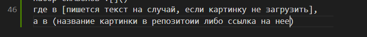

# Homework for lesson 2

# Краткая инструкция основных команд и методов работы в Git

## Основные команды в Git

git add - добавляет файл в индекс

git branch - показывает, создает и даже удаляет ветви

git checkout - позволяет переключаться между ветвями, файлами в консоли, коммитами

git clean - удаляет неотслеживаемые файлы из консоли

git clone - клонирует репозиторий в новую папку

git commit - записывает изменения в репозиторий

git diff - выводит изменения между коммитами, коммитом и консольюи т.д.

git fetch - загружает объекты и цитаты из другого репозитория

git gc - убирает ненужные файлы и приводит в порядок локальный репозиторий

git init - созадет пустой репозиторий Git или заново инициализирует существующий

git log - выводит журнал коммитов

git merge - объединяет две или несколько ветвей

git status - выводит состояние консоли

git switch - переключает между ветвями

[ссылка на источник систематизированной информации](https://git-scm.com/docs/git#_git_commands)
=======

# Инструкция по работе с GIT

## Базовые команды
в случаях, когда необходимо добавить гиперссылку применяется [] и текст гиперссылки, и в итоге получается [такой_пример] http://link.to.nowhere.com/

*git init* - **команда для инициализации репозитория**

*git add* - **команда для доваления версии к файлу**

*git status* - **команда для определения статуса репозитория**

*git commit -m <message>* - **команда для фиксации изменений в репозитории**

=======
## Основные методы работы с информацией в Git

<Markdown – это облегченный язык разметки, который является инструментом преобразования кода в HTML. Главной особенностью данного языка является максимально простой синтаксис, который служит для упрощения написания и чтения кода разметки, что, в свою очередь, позволяет легко его корректировать>

В Markdown можно добавлять заголовки 1-го уровня с помощью (#) или с помощью (=),
заголовки 2-го уровня с помощью (##) или (-), с 3-го по 6-й с помощью соответтвующего количества знаков (#) в начале строки

Для обозначения цитат применяется знак (>), который ставится в начале цитаты, с установкой дополнительных (>) можно создавать дополнительные уровни цитирования (максимальный - 15)

Для создания ненумерованных списков можно выбрать один из вариантов: 
* с помощью знака (*)
- с помощью знака (-)
+ с помощью знака (+)
а для нумерованных списков
1. с помощью (1., 2. и т.д.)

Для разделения текста с помощью горизонтальной линии в Markdown применяются (***),

***

размещенные в отдельной строке, либо (---),

------

как в примере выше

Для указания ссылок применяюстя следующие знаки , где в [указывается описание ссылки], а в (сама ссылка на источник), [например](http://link.to.nowhere.com/)

в случаях, когда необходимо добавить гиперссылку применяется [] и текст гиперссылки, и в итоге получается [такой_пример] http://link.to.nowhere.com/

Также в Markdown есть различные варианты форматирования текста:

*курсивный*, обрамленный знаками (*) или (_) 

**полужирный**, обрамленный знаками (**) или (__)

Для выделения фрагментов строки, содержащей код необходимо обрамить его обратными апострофами, например так - `example`

Для удобного добавления изображения в Markdown применятся набор символов: восклицательный знак, квадратные скобки, обычные скобки

Для того, чтобы имеющиеся репозитории получили удаленный доступ, необходимо закинуть их в *GitHub*

Первым делом необходимо создать учетную запись на [сайте сервиса GitHub](https://www.github.com)

После авторизации открывается доступ к своему репозиторию, либо к иным репозиториям и файлам, находящимся в открытом доступе.
  
Для того, чтобы скачать имеющийся репозиторий, применяется команда *git clone <repository URL>*. Программа скачивает нужный репозиторий и открывает его для редактирования на локальному уровне.

